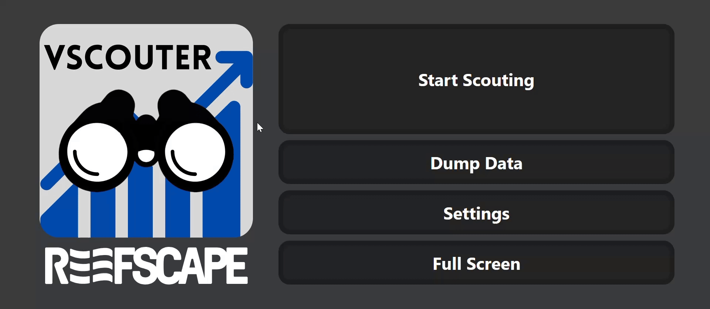

## Inputting Auto Completion Match Data

There are two ways to input match data into the app:

### Using QR Codes

1.  Click the Settings button on the main page.
2.  Select the Get Match Data button.
3.  Choose the Online option.
4.  Scan the QR code with your scouting device.
5.  Once the QR code is scanned, click Submit to input the match data into the app.

### Manually Inputting a Match Data File

1.  Click the Settings button on the main page.
2.  Select the Get Match Data button.
3.  Choose the Offline option.
4.  Select the match data file you want to input from your device.
5.  Once the file is selected, click Submit to input the match data into the app.

