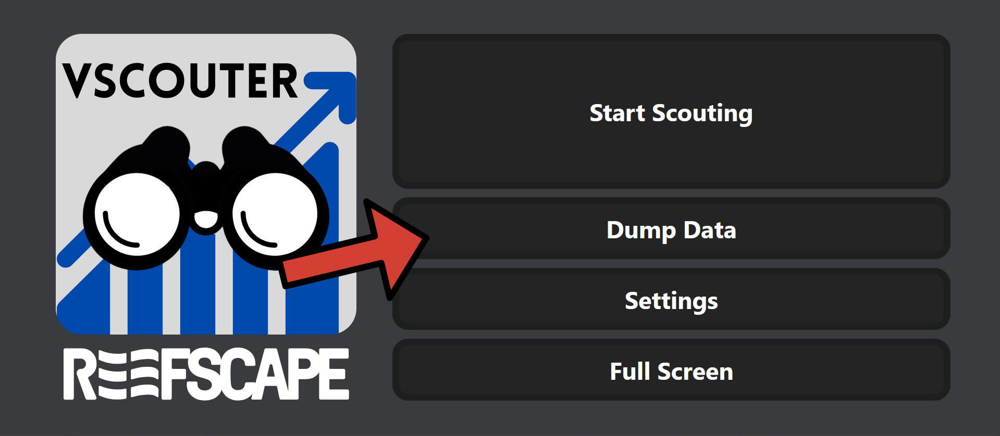
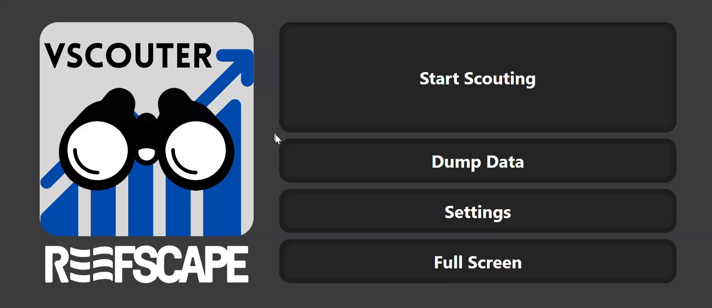

### Collecting Data

**Use this video for a visual overview on how to parse and collect your data:**

1. To collect the data that the scouters have collected, collect a USB flash drive to the devices and click the `Dump Data` button on the home screen. This will download a JSON file of the scouting data. Move this and repeat for each of the scouting devices.
   
2. You may want to delete the scouting data off of the device when done taking the data. This can be done by clicking the `Settings` button and then the `Clear Scouting Data` button.
   
