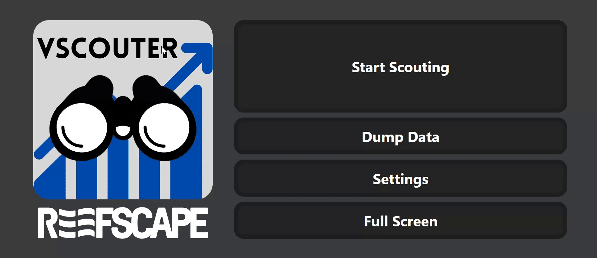

### Parsing Data

**Use this video for a visual overview on how to parse and collect your data:**

1. To get to the parsing data page, click the `Settings` button, and then `Parse Data`.
2. To select the data that was scouted, plug the USB flash drive in with the collected data, click the `Select Files` button, and select all of the JSON data. This will add the files in a list to the right. If a file needs to be removed, the `x` button can be clicked next to the file names.
3. To combine this data into a CSV format, click the `Compile and Download` button. This will download a CSV file with the inputted data.
4. Feed this CSV file into the data analysis software.
   
