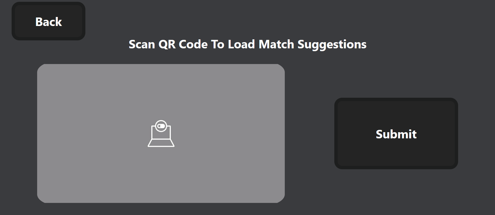

### Using The Website

**Use this video for a visual overview on how to scout:**

1. Visit [https://vscouter.netlify.app/](https://vscouter.netlify.app/)
2. **Main Page:** When the scouter loads into the app there are 4 main buttons. The `Full Screen` button makes the website go into full screen mode. The `Dump Data` button will download a JSON file of the scouting data. See [Collecting Data](#collecting-data) for more info. The `Start Scouting` button continues to the game start scouting page.
   
3. **Settings Page:** Has various buttons for debugging and for loading auto match suggestions. `Get Match Data` redirects to the page for getting the auto match suggestions. See [Auto Completion Match Data](#auto-completion-match-data) for more info. `Clear Match Data` clears the auto match suggestions. `Clear Scouting Data` clears the scouting data that is saved on the device. `View Scouting Data` opens a page where the user is able to see the JSON version of the scouting data for debugging. The `Parse Data` button brings the user to the parse data page. See [Parsing Data](#parsing-data) for more info.
   
4. **Match Data:** Here the scouter can scan a QR code leading to the generated match data for the auto competition. See more at [Using](#using) of [Auto Completion Match Data](#auto-completion-match-data).
   
5. **Game Start:** The `Select Alliance` component allows the scouter to select the alliance they are scouting. The `Match Number` component allows the scouter to enter the match they are scouting. The `Scouting Initials` component allows the scouter to enter their initials. The `Select Team` component shows auto completion buttons that are based on the alliance and match that the scouter inputted previously. Additionally, the scouter may choose to select a different team than auto suggested. The button/input that is darker than the other is what is selected. The scouter may choose to click the `Back` Button to return to the past page. To advance to the next page, the scouter can click the `Proceed` button.
   
6. **Auto Start:** The scouter can enter where the robot generally starts. They may do this by clicking each zone on the map. The scouter may choose to click the `Back` Button to return to the past page. To advance to the next page, the scouter can click the `Proceed` button.
   
7. **Auto Scoring:** The page is separated into two main sections: coral and algae. In the coral section there is a side view of the reef separated into the levels of it: L1, L2, L3, L4, and Drop/Missed. Then there is a set of all the places you can pick a coral up in auto: the station, mark 1, mark 2, and mark 3. The roadmap of the user's input is selected where they got a coral and then where they placed it. In the algae section, the user may select where they picked up an algae (the reef, mark 1, mark 2, and mark 3) and where they placed it (net shot, processor, and drop/miss). The `Passed Starting Line` button automatically selects if the scouter selects any other action. The `Proceed` button starts blinking after 15 seconds to remind the scouter to switch pages.
   | Keybind | Button |
   |---------|-----------------------|
   | ` | Drop Miss Coral |
   | 1 | Place Coral L1 |
   | 2 | Place Coral L2 |
   | 3 | Place Coral L3 |
   | 4 | Place Coral L4 |
   | q | Pick Coral Station |
   | w | Pick Coral Mark 1 |
   | e | Pick Coral Mark 2 |
   | r | Pick Coral Mark 3 |
   | 9 | Place Algae Net Shot |
   | 0 | Place Algae Processor |
   | - | Drop Miss Algae |
   | u | Pick Algae Reef |
   | i | Pick Algae Mark 1 |
   | o | Pick Algae Mark 2 |
   | p | Pick Algae Mark 3 |

 8. **Teleop Scoring:** This page is similar to the auto scoring page. The page is separated into two main sections: coral and algae. In the coral section there is a side view of the reef separated into the levels of it: L1, L2, L3, L4, and Drop/Missed. Then there is a set of all the places you can pick a coral up in auto: the station and the carpet. The roadmap of the user's input is selected where they got a coral and then where they placed it. In the algae section, the user may select where they picked up an algae (the reef and carpet) and where they placed it (net shot, processor, and drop/miss).
| Keybind | Button |
|---------|-----------------------|
| ` | Drop Miss Coral |
| 1 | Place Coral L1 |
| 2 | Place Coral L2 |
| 3 | Place Coral L3 |
| 4 | Place Coral L4 |
| q | Pick Coral Station |
| w | Pick Coral Carpet |
| 9 | Place Algae Net Shot |
| 0 | Place Algae Processor |
| - | Drop Miss Algae |
| u | Pick Algae Reef |
| i | Pick Algae Carpet |

 9. **Endgame Scoring:** The `Shallow Climb`, `Deep Climb`, and `Park` buttons represent what the robot can do on the barge. Then there are toggles for if the robots climb failed, it played defense, and it if it broke down. The `Comments` textbox allows for the scouter to write any additional information such as if they broke down or got penalties.

